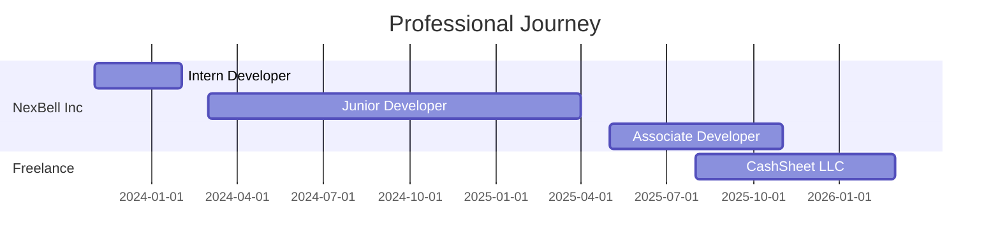

<div align="center">
  
</div>

<p align="center">
  
  
</p>

<p align="center">
  <b>Building scalable web applications | Integrating APIs | Automating business workflows</b><br>
  <i>Passionate about clean architecture, modular code, and process automation</i><br>
  <a href="https://medium.com/@mmoznu">
    
  </a>
</p>

---

## Skill Proficiency

**Backend Development**


**Frontend Development**


**DevOps & Cloud**


---

## Career Timeline



---

## Work Experience

### Freelance Software Developer
**CashSheet LLC** | Aug 2025 - Present | Remote, United States

- Independently developing a multi-tenant, double-entry accounting platform
- Built core accounting features: ledger & journal management, transaction processing, multi-organization setup with RBAC
- Integrated Wagtail CMS for flexible content management
- Implemented dual-level Stripe billing (platform & tenant-level)
- Managing full lifecycle: system design, backend development, database modeling, deployment, and maintenance

### Associate Software Developer
**NexBell Inc** | May 2025 - Nov 2025 | Remote, Bangladesh

- Led and mentored intern development team, ensuring task clarity and sprint alignment
- Introduced REST APIs within existing MVT architecture, enhancing system interoperability
- Refactored legacy codebase, improving performance, maintainability, and scalability
- Conducted code reviews and maintained high standards for code quality
- Assisted in sprint planning and task allocation for timely project delivery

### Junior Software Developer
**NexBell Inc** | Mar 2024 - Apr 2025 | Bangladesh

- Developed and maintained Django-based applications
- Implemented Django REST Framework APIs
- Collaborated with cross-functional teams on project delivery

### Intern Software Developer
**NexBell Inc** | Nov 2023 - Feb 2024 | Remote, Bangladesh

- Built digital product selling platform integrating third-party services
- Optimized application for seamless user experience
- Fixed bugs, tested applications, and organized codebase for redeployment

---

## Tech Stack & Skills

### Languages & Frameworks
<p>
  
  
  
  
  
  
  
</p>

### Frontend & Styling
<p>
  
  
  
  
  
</p>

### Databases & Caching
<p>
  
  
  
  
  
</p>

### DevOps & Cloud
<p>
  
  
  
  
  
  
  
  
</p>

### APIs & Integration
<p>
  
  
  
  
  
</p>

### Testing & Automation
<p>
  
</p>

---

## Development Environment

<p>
  
  
  
  
  
  
</p>

---

## Currently Exploring

<table align="center">
  <tr>
    <td align="center" width="50%">
      <b>AI/ML Integration</b>
      <br><sub>Exploring machine learning models</sub>
    </td>
    <td align="center" width="50%">
      <b>AI-Powered Development</b>
      <br><sub>Using Cursor & Amazon Q Developer</sub>
    </td>
  </tr>
</table>

---

## Published PyPI Packages

<p align="center">
  <a href="https://pypi.org/project/wagtail-subscriptions/">
    
  </a>
  <a href="https://pypi.org/project/pathao/">
    
  </a>
  <a href="https://pypi.org/project/steadfast-python/">
    
  </a>
</p>

<p align="center">
  <a href="https://pypi.org/project/wagtail-subscriptions/">
    
  </a>
  <a href="https://pypi.org/project/pathao/">
    
  </a>
  <a href="https://pypi.org/project/steadfast-python/">
    
  </a>
</p>

---

## Featured Projects

<table align="center">
  <tr>
    <th>Project</th>
    <th>Description</th>
    <th>Tech Stack</th>
  </tr>
  <tr>
    <td><b><a href="https://github.com/mojnomiya/shopify_automation_demo">Shopify Automation Demo</a></b></td>
    <td>Django app automating Shopify order fulfillment workflows</td>
    <td><code>Django</code> <code>Celery</code> <code>REST API</code></td>
  </tr>
  <tr>
    <td><b><a href="https://github.com/mojnomiya/wagtail_subscriptions">Wagtail Subscriptions</a></b></td>
    <td>Subscription-based system built with Wagtail CMS</td>
    <td><code>Wagtail</code> <code>Django</code> <code>PostgreSQL</code></td>
  </tr>
  <tr>
    <td><b><a href="https://github.com/mojnomiya/pathao-python">Pathao Python SDK</a></b></td>
    <td>Comprehensive Python SDK for Pathao Courier Merchant API</td>
    <td><code>Python</code> <code>REST API</code> <code>SDK</code></td>
  </tr>
  <tr>
    <td><b><a href="https://github.com/mojnomiya/steadfast-python">Steadfast Python SDK</a></b></td>
    <td>Python SDK for Steadfast Courier API integration</td>
    <td><code>Python</code> <code>REST API</code> <code>SDK</code></td>
  </tr>
</table>

<p align="center">
  <a href="https://github.com/mojnomiya?tab=repositories">
    
  </a>
</p>

---

## GitHub Metrics Dashboard

<p align="center">
  
</p>

<p align="center">
  
  
</p>

<p align="center">
  
  
</p>

---

## GitHub Analytics

<p align="center">
  
</p>

<p align="center">
  
</p>

<details align="center">
  <summary><b>GitHub Trophies</b></summary>
  <br>
  <p align="center">
    
  </p>
</details>

---

## Recent GitHub Activity

<!--START_SECTION:activity-->
1. 💪 Opened PR [#1](https://github.com/shemanto27/One-Click-Production-Ready-Django-Backend-Setup/pull/1) in [shemanto27/One-Click-Production-Ready-Django-Backend-Setup](https://github.com/shemanto27/One-Click-Production-Ready-Django-Backend-Setup)
2. 🎉 Merged PR [#2](https://github.com/mojnomiya/django-ledger/pull/2) in [mojnomiya/django-ledger](https://github.com/mojnomiya/django-ledger)
3. 💪 Opened PR [#2](https://github.com/mojnomiya/django-ledger/pull/2) in [mojnomiya/django-ledger](https://github.com/mojnomiya/django-ledger)
<!--END_SECTION:activity-->

---

## Coding Philosophy

```python
class Developer:
    def __init__(self):
        self.name = "Md Mojno Miya"
        self.role = "Django Developer"
        self.language_spoken = ["bn_BD", "en_US"]
    
    def say_hi(self):
        print("Thanks for dropping by! Let's build something amazing together.")

    @property
    def current_focus(self):
        return [
            "Building scalable SaaS platforms",
            "Exploring AI/ML integration",
            "Contributing to open source"
        ]

me = Developer()
me.say_hi()
```

---

## Learning Goals

- **Advanced System Design** - Microservices architecture and distributed systems
- **Machine Learning** - Integrating ML models into Django applications
- **Go Programming** - Building high-performance backend services
- **Cloud Architecture** - AWS Solutions Architect certification path
- **DevOps Practices** - Kubernetes and advanced CI/CD pipelines

---

## Availability

<p align="center">
  
  
</p>

<p align="center">
  <i>Open to interesting projects and full-time opportunities. Let's discuss how I can help bring your ideas to life!</i>
</p>

---

## Let's Connect

<p align="center">
  <a href="https://github.com/mojnomiya">
    
  </a>
  <a href="https://www.linkedin.com/in/mojnomiya/">
    
  </a>
  <a href="mailto:mojnomiya@example.com">
    
  </a>
</p>

<p align="center">
  <i>Open to collaborations, freelance projects, and interesting conversations!</i>
</p>

---

<div align="center">
  
</div>

<p align="center">
  <b>"Code with purpose, automate with precision."</b>
</p>
